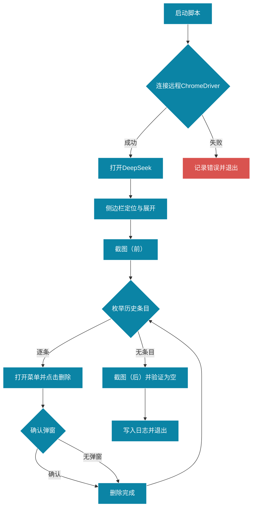

# DeepSeek 历史问答清空脚本

用于通过远程 ChromeDriver + Selenium WebDriver 操作 DeepSeek 网页版，批量清空左侧边栏的问答历史。

## 功能概述

- 远程连接 ChromeDriver，控制 Chrome 浏览器
- 自动定位并展开左侧边栏
- 枚举所有历史问答条目并逐条删除
- 处理删除确认弹窗
- 执行前后截图用于对比验证
- 完整操作日志写入到 `logs/`

## 安装与准备

- Node.js ≥ 16，已安装项目依赖
- 启动远程 ChromeDriver（示例）：

```
chromedriver --port=9515 --allowed-origins=* --url-base=/
```

- 安装 TypeScript 执行环境：

```
npm i -D typescript ts-node @types/node
```

## 运行方式

- 通过 npm 脚本（推荐）：

```
npm run clear-history -- --remote http://127.0.0.1:9515 --url https://chat.deepseek.com/ --timeout 20000 --headless
```

- 直接使用 ts-node：

```
npx ts-node --esm src/deepseek-clear-history.ts --remote http://127.0.0.1:9515 --url https://chat.deepseek.com/ --timeout 20000 --headless
```

提示：建议预先在浏览器中登录 DeepSeek 账号，脚本将基于已登录会话执行。

## 命令行参数

- `--remote` 远程 ChromeDriver 地址，默认 `http://127.0.0.1:9515`
- `--url` DeepSeek 入口地址，默认 `https://chat.deepseek.com/`
- `--timeout` 显式等待超时（毫秒），默认 `20000`
- `--headless` 启用无头模式（可选）

## 工作流程



## 技术要点

- 显式等待：`until.elementLocated`、`until.elementIsVisible`、`until.elementIsEnabled`
- 精准定位：优先使用 `CSS`/`XPath` 组合，提高对动态 DOM 的适配性
- 异常处理：逐项删除过程中采用 `try-catch` 保证鲁棒性
- 日志记录：同时输出到控制台与 `logs/deepseek-clear-history_*.log`
- 截图对比：前后截图保存到 `output/history-before_*.png` 与 `output/history-after_*.png`

## 选择器说明

- 侧边栏容器：`aside`、`[data-testid*="sidebar"]`、`[class*="sidebar" i]`
- 历史条目：`aside a[href*="/chat/"]`、`//aside//a[contains(@href, "/chat/")]`
- 条目菜单：`button[aria-label*="更多"|"More"]`、`button[aria-label*="菜单"]`
- 菜单删除：`//div[@role="menu"]//*[contains(text(), "删除"|"Delete")]`
- 确认弹窗：`//div[@role="dialog"]//button[contains(., "删除"|"确认"|"Delete"|"OK")]`

## 测试用例（10 组）

1. 已登录且存在 1 条历史，执行后应为空；日志记录成功；前后截图存在
2. 已登录且存在多条历史，逐条删除后应为空；无异常中断
3. 未登录，页面停留在登录页；脚本记录错误并退出，截图存在
4. 侧边栏被折叠，脚本能自动展开并继续删除
5. 条目没有三点菜单但存在直接删除按钮，脚本应跳过或继续下一个条目
6. 删除弹窗出现并确认；条目被删除；无残留
7. 删除弹窗未出现；脚本继续下一条目，最终应为空
8. 网络延迟较大，超时参数提高到 30000，删除流程仍能完成
9. `--headless` 模式运行，截图与日志正常生成
10. 远程地址错误，无法连接；脚本记录错误并退出，不修改任何数据

## 验证与安全

- 删除范围限定在左侧边栏下的 `/chat/` 链接，避免误删设置或其他入口
- 删除完成后二次验证：重新统计条目数量应为 0
- 所有操作均记录日志，保留可追溯性

## 常见问题

- 无法定位元素：提高 `--timeout` 或确认 DeepSeek 已登录
- 远程连接失败：检查 ChromeDriver 是否启动且允许 CORS/来源
- 截图保存失败：确保 `output/` 目录可写

## 类型检查

```
npm run typecheck
```

若需代码规范校验，请告知使用的 lint 命令，我将集成到脚本中。